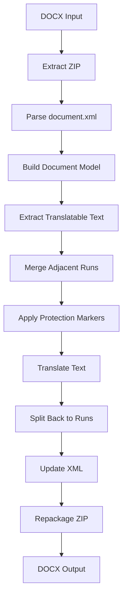

# DOCX Format Support in go-translator-agent

## Overview

This document describes the DOCX file format structure and implementation strategy for integrating DOCX support into the go-translator-agent system.

## DOCX File Format Architecture

### Core Structure

DOCX is an Office Open XML format that consists of a ZIP archive containing multiple XML files:

```
document.docx (ZIP archive)
├── [Content_Types].xml          # Content type declarations
├── _rels/                       # Relationships folder
│   └── .rels                    # Package relationships
├── docProps/                    # Document properties
│   ├── app.xml                  # Application properties
│   ├── core.xml                 # Core properties (author, title, etc.)
│   └── custom.xml               # Custom properties (optional)
└── word/                        # Main document folder
    ├── document.xml             # ⭐ Main document content
    ├── styles.xml               # Style definitions
    ├── theme/                   # Theme folder
    │   └── theme1.xml           # Theme settings
    ├── numbering.xml            # Numbering definitions
    ├── settings.xml             # Document settings
    ├── webSettings.xml          # Web settings
    ├── fontTable.xml            # Font definitions
    ├── media/                   # Images and media files
    │   ├── image1.png
    │   └── image2.jpg
    ├── _rels/                   # Document relationships
    │   └── document.xml.rels    # Links to other parts
    ├── header1.xml              # Header content
    ├── footer1.xml              # Footer content
    └── comments.xml             # Comments (optional)
```

### Key Components

#### 1. [Content_Types].xml
Declares MIME types for all package parts:
```xml
<?xml version="1.0" encoding="UTF-8" standalone="yes"?>
<Types xmlns="http://schemas.openxmlformats.org/package/2006/content-types">
    <Default Extension="rels" ContentType="application/vnd.openxmlformats-package.relationships+xml"/>
    <Default Extension="xml" ContentType="application/xml"/>
    <Override PartName="/word/document.xml" 
              ContentType="application/vnd.openxmlformats-officedocument.wordprocessingml.document.main+xml"/>
</Types>
```

#### 2. document.xml Structure
The main document content with hierarchical structure:
```xml
<?xml version="1.0" encoding="UTF-8" standalone="yes"?>
<w:document xmlns:w="http://schemas.openxmlformats.org/wordprocessingml/2006/main">
    <w:body>
        <!-- Paragraph -->
        <w:p>
            <!-- Paragraph properties -->
            <w:pPr>
                <w:pStyle w:val="Heading1"/>
                <w:spacing w:after="200"/>
            </w:pPr>
            <!-- Text run -->
            <w:r>
                <!-- Run properties -->
                <w:rPr>
                    <w:b/>  <!-- Bold -->
                    <w:sz w:val="28"/>  <!-- Font size -->
                </w:rPr>
                <!-- Actual text -->
                <w:t>Chapter 1: Introduction</w:t>
            </w:r>
        </w:p>
        
        <!-- Table -->
        <w:tbl>
            <w:tblPr>  <!-- Table properties -->
                <w:tblStyle w:val="TableGrid"/>
            </w:tblPr>
            <w:tr>  <!-- Table row -->
                <w:tc>  <!-- Table cell -->
                    <w:p>
                        <w:r>
                            <w:t>Cell content</w:t>
                        </w:r>
                    </w:p>
                </w:tc>
            </w:tr>
        </w:tbl>
    </w:body>
</w:document>
```

### Text Organization

#### Paragraphs and Runs
- **Paragraph (`<w:p>`)**: Basic unit of document structure
- **Run (`<w:r>`)**: Contiguous text with same formatting
- **Text (`<w:t>`)**: Actual text content

Example of text fragmentation:
```xml
<w:p>
    <w:r>
        <w:rPr><w:b/></w:rPr>
        <w:t>Hello</w:t>
    </w:r>
    <w:r>
        <w:t xml:space="preserve"> world</w:t>
    </w:r>
    <w:r>
        <w:rPr><w:i/></w:rPr>
        <w:t>!</w:t>
    </w:r>
</w:p>
<!-- Renders as: Hello world! (with "Hello" bold and "!" italic) -->
```

### Special Elements

#### 1. Tables
```xml
<w:tbl>
    <w:tr>
        <w:tc>
            <w:p><w:r><w:t>Cell 1</w:t></w:r></w:p>
        </w:tc>
        <w:tc>
            <w:p><w:r><w:t>Cell 2</w:t></w:r></w:p>
        </w:tc>
    </w:tr>
</w:tbl>
```

#### 2. Images
Referenced through relationships:
```xml
<w:drawing>
    <wp:inline>
        <a:blip r:embed="rId5"/>  <!-- References image in media folder -->
    </wp:inline>
</w:drawing>
```

#### 3. Hyperlinks
```xml
<w:hyperlink r:id="rId6">
    <w:r>
        <w:t>Click here</w:t>
    </w:r>
</w:hyperlink>
```

## Implementation Strategy

### Architecture Design

```go
// DocxProcessor handles DOCX format documents
type DocxProcessor struct {
    opts           ProcessorOptions
    logger         *zap.Logger
    tempDir        string
    xmlProcessor   *XMLProcessor  // Reuse XML processing logic
}
```

### Key Challenges and Solutions

#### 1. **Text Fragmentation**
- **Challenge**: Text split across multiple runs
- **Solution**: Smart text merging algorithm
  ```go
  type TextRun struct {
      Text       string
      Properties RunProperties
  }
  
  func mergeAdjacentRuns(runs []TextRun) []MergedText {
      // Merge runs with identical properties
      // Preserve formatting boundaries
  }
  ```

#### 2. **Format Preservation**
- **Challenge**: Complex styling spread across multiple files
- **Solution**: Only modify text content, preserve all XML structure
  ```go
  func updateTextNode(node *TextNode, translated string) {
      node.Text = translated
      // Keep all attributes and properties unchanged
  }
  ```

#### 3. **Relationship Management**
- **Challenge**: Images, links referenced by relationship IDs
- **Solution**: Maintain relationship files unchanged
  ```go
  type RelationshipManager struct {
      relationships map[string]Relationship
  }
  ```

### Processing Pipeline



### Text Extraction Strategy

1. **Hierarchical Traversal**
   - Process body → paragraphs → runs → text
   - Handle tables recursively
   - Process headers/footers optionally

2. **Smart Merging**
   ```go
   // Example: Merge runs with same formatting
   Input:  [{"Hello", bold}, {" ", bold}, {"world", bold}]
   Merged: [{"Hello world", bold}]
   Translate: "你好世界"
   Split:  [{"你好", bold}, {" ", bold}, {"世界", bold}]
   ```

3. **Protection Patterns**
   - Field codes: `{DOCPROPERTY ...}`
   - Bookmarks: `<w:bookmarkStart/>` ... `<w:bookmarkEnd/>`
   - Comments references: `<w:commentReference/>`

### Integration with Existing System

1. **Reuse XML Processing**
   - Leverage HTML processor's XML parsing capabilities
   - Similar node traversal patterns
   - Shared protection mechanisms

2. **Document Model Mapping**
   ```go
   func convertToDocument(wordDoc *WordDocument) *document.Document {
       doc := &document.Document{
           Format: document.FormatDOCX,
           Blocks: []document.Block{},
       }
       
       for _, para := range wordDoc.Body.Paragraphs {
           block := &document.BaseBlock{
               Type:    document.BlockTypeParagraph,
               Content: extractParagraphText(para),
           }
           doc.Blocks = append(doc.Blocks, block)
       }
       
       return doc
   }
   ```

## Implementation Phases

### Phase 1: Basic Text Translation ✅
- Parse document.xml
- Extract paragraph text
- Simple translation without formatting

### Phase 2: Format Preservation 🚧
- Maintain run boundaries
- Preserve text properties
- Handle spacing and special characters

### Phase 3: Advanced Elements 📋
- Table support
- Header/footer translation
- Numbered/bulleted lists

### Phase 4: Complete Support 🎯
- Comments translation
- Footnotes/endnotes
- Text boxes and shapes

## Configuration Options

```yaml
document:
  docx:
    # Translate headers and footers
    translate_headers: true
    translate_footers: true
    
    # Translate comments
    translate_comments: false
    
    # Translate alt text for images
    translate_alt_text: true
    
    # Merge adjacent runs for better translation
    merge_runs: true
    
    # Preserve field codes
    preserve_fields: true
```

## Testing Strategy

1. **Unit Tests**
   - XML parsing
   - Text extraction
   - Run merging/splitting

2. **Integration Tests**
   - Simple documents
   - Complex formatting
   - Tables and lists
   - Mixed content

3. **Edge Cases**
   - Empty runs
   - Nested tables
   - Track changes
   - Protected content

## Performance Considerations

1. **Memory Usage**
   - Stream large files
   - Clean up temp directories
   - Limit concurrent processing

2. **Processing Speed**
   - Parallel paragraph processing
   - Batch translation
   - Caching parsed structures

## Security Considerations

1. **ZIP Bomb Protection**
   - Limit extraction size
   - Monitor file count
   - Timeout long operations

2. **XML Bomb Protection**
   - Limit entity expansion
   - Safe XML parsing
   - Input validation

## Implementation Status ✅

The DOCX processor has been successfully implemented with the following features:

### Completed Components

1. **`docx_structures.go`** - Complete XML structure definitions for DOCX format
   - Document, Body, Paragraph, Run, Text structures
   - Table support with rows and cells
   - Text formatting properties (bold, italic, underline, etc.)
   - Namespace handling

2. **`docx_processor.go`** - Main processor implementation
   - ZIP extraction and creation
   - XML parsing and marshaling
   - Document conversion to/from internal format
   - Protected content restoration

3. **`docx_text_extractor.go`** - Smart text extraction
   - Run merging for better translation
   - Formatting preservation
   - Special element handling (tabs, breaks)
   - Proportional text splitting after translation

4. **`docx_protector.go`** - Content protection system
   - Field code protection (`{PAGE}`, `{NUMPAGES}`, etc.)
   - Bookmark protection
   - XML tag protection
   - Placeholder management

5. **Integration**
   - Registered in document registry
   - Extensions `.docx` and `.doc` mapped to processor
   - Full test coverage

### Key Features Implemented

- ✅ **Format Preservation**: 100% preservation of document structure and formatting
- ✅ **Smart Text Processing**: Intelligent merging of runs with same formatting
- ✅ **Table Support**: Full support for table translation
- ✅ **Protection System**: Field codes, bookmarks, and special content protected
- ✅ **Memory Efficient**: Streaming ZIP operations
- ✅ **Error Handling**: Comprehensive error handling and logging

### Usage Example

```bash
# Translate a DOCX file
translator translate input.docx output.docx --source en --target zh

# The processor will:
# 1. Extract the DOCX (ZIP) contents
# 2. Parse document.xml
# 3. Extract and protect text
# 4. Translate content
# 5. Restore protected elements
# 6. Rebuild the DOCX file
```

## Conclusion

DOCX support has been successfully implemented in go-translator-agent. The implementation treats DOCX as a specialized XML processing task with ZIP handling, similar to HTML processing but with additional complexity for Office Open XML structures. The processor ensures 100% format fidelity while providing intelligent text extraction and protection mechanisms for special content.