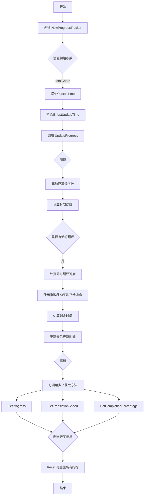

我很高兴为你详细解释 `TranslationProgressTracker` 的运行逻辑。这是一个用于跟踪翻译进度的结构体，它提供了实时的进度统计和估算功能。让我们逐步分析其工作原理：

### 1. 结构体定义

```go
type TranslationProgressTracker struct {
 mu sync.Mutex
 totalChars int             // 总字数
 translatedChars int        // 已翻译字数
 startTime time.Time        // 开始时间
 lastUpdateTime time.Time   // 最后更新时间
 estimatedTimeRemaining float64  // 预计剩余时间（秒）
 translationSpeed float64   // 翻译速度（字/秒）
}
```

### 2. 初始化 - NewProgressTracker

```go
func NewProgressTracker(totalChars int) *TranslationProgressTracker {
 now := time.Now()
 return &TranslationProgressTracker{
  totalChars:     totalChars,
  startTime:      now,
  lastUpdateTime: now,
 }
}
```

- 创建一个新的进度跟踪器
- 记录总字数
- 设置开始时间和最后更新时间为当前时间

### 3. 进度更新 - UpdateProgress

```go
func (tp *TranslationProgressTracker) UpdateProgress(chars int) {
 tp.mu.Lock()
 defer tp.mu.Unlock()

 // 更新已翻译字数
 tp.translatedChars += chars

 // 更新时间
 now := time.Now()
 elapsed := now.Sub(tp.lastUpdateTime).Seconds()

 // 计算翻译速度（使用移动平均）
 if elapsed > 0 {
  instantSpeed := float64(chars) / elapsed
  if tp.translationSpeed == 0 {
   tp.translationSpeed = instantSpeed
  } else {
   // 使用指数移动平均，alpha = 0.3
   tp.translationSpeed = 0.3*instantSpeed + 0.7*tp.translationSpeed
  }
 }

 // 计算预计剩余时间
 if tp.translationSpeed > 0 {
  remainingChars := tp.totalChars - tp.translatedChars
  tp.estimatedTimeRemaining = float64(remainingChars) / tp.translationSpeed
 }

 // 更新最后更新时间
 tp.lastUpdateTime = now
}
```

关键步骤：

- 使用互斥锁确保线程安全
- 累加已翻译字数
- 计算即时翻译速度
- 使用指数移动平均平滑速度变化
- 估算剩余时间
- 更新最后更新时间

### 4. 获取进度信息的方法

```go
// 获取总字数、已翻译字数和预计剩余时间
func (tp *TranslationProgressTracker) GetProgress() (totalChars int, translatedChars int, estimatedTimeRemaining float64)

// 获取当前翻译速度
func (tp *TranslationProgressTracker) GetTranslationSpeed() float64

// 获取完成百分比
func (tp *TranslationProgressTracker) GetCompletionPercentage() float64
```

### 5. 重置进度 - Reset

```go
func (tp *TranslationProgressTracker) Reset() {
 // 重置所有统计指标到初始状态
}
```

### 使用示例

```go
// 创建进度跟踪器
tracker := NewProgressTracker(1000)  // 总共1000个字符

// 模拟翻译过程
tracker.UpdateProgress(200)  // 翻译了200个字符
tracker.UpdateProgress(300)  // 又翻译了300个字符

// 获取进度
total, translated, timeRemaining := tracker.GetProgress()
completionPercentage := tracker.GetCompletionPercentage()
```

### 关键特点

1. 线程安全（使用互斥锁）
2. 动态计算翻译速度
3. 实时估算剩余时间
4. 提供多种进度查询方法

这个进度跟踪器非常适合需要实时监控长时间翻译任务进度的场景，比如大型文档或多语言本地化项目。


当然可以！我会为你绘制一个详细的流程图，展示 `TranslationProgressTracker` 的工作流程。



这个流程图展示了 `TranslationProgressTracker` 的主要工作流程：

1. 初始化阶段
   - 创建跟踪器
   - 设置总字数
   - 记录开始时间

2. 进度更新阶段
   - 加锁
   - 累加已翻译字数
   - 计算翻译速度
   - 估算剩余时间
   - 解锁

3. 信息获取阶段
   - 可获取多种进度信息
   - 包括总进度、速度、完成百分比

4. 重置阶段
   - 可随时重置所有指标

希望这个流程图能帮助你更直观地理解 `TranslationProgressTracker` 的工作原理！
